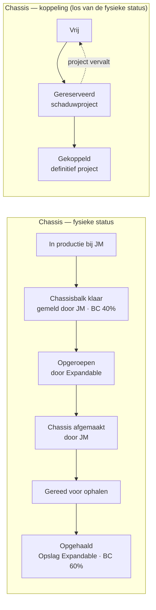
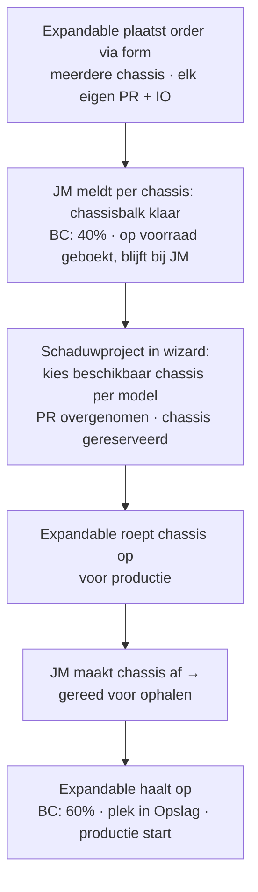

# JM Construct — chassisplanning (voorstel)

**Status:** concept 0.4 · feedback Damian 24-07-2026 verwerkt · ter afstemming met JM Construct
**Doel van dit document:** vastleggen wat er gebouwd gaat worden voor de gezamenlijke chassisplanning met JM Construct. De uitgangspunten in §9 zijn intern vastgesteld; §10 bevat wat nog moet worden bepaald (o.a. doorlooptijden).

---

## 1. Doel & context

JM Construct bouwt chassis voor Expandable. Een order (batch) kan **meerdere chassis** bevatten; **elk chassis heeft een eigen PR-nummer én een eigen IO-nummer** (inkoopnummer). Het PR-nummer komt uit **Business Central** en wordt door Expandable handmatig ingevuld — het is hetzelfde PR-nummer dat daarna in de productieplanning de enige identificatie van project én trailer is.

Een chassis wordt niet in één keer gebouwd: JM maakt eerst de **chassisbalk**; die blijft daarna **bij JM op voorraad** tot Expandable het chassis **oproept voor productie**, waarna JM het chassis afmaakt en Expandable het ophaalt.

Vandaag wordt dit bijgehouden in een los **Excel-overzicht** — welke orders lopen er bij JM, hoe ver zijn ze, welke chassis staan er per model op voorraad en welke zijn al aan een (schaduw)project gekoppeld — dat losstaat van de planner en handmatig actueel gehouden moet worden. Deze JM-planning vervangt dat Excel-overzicht en brengt het in de app, gekoppeld aan de projecten.

De planning wordt opgezet zoals het bestaande Planning-scherm: drie weergaven naast elkaar in één tabbalk — **Tijdsplanning**, **Capaciteitsplanning** en **Locatieplanning** — en is bedoeld om **samen met JM Construct** in te werken.

## 2. Kernprincipes

1. **Elk chassis heeft een eigen PR-nummer én IO-nummer.** Een order is in feite een **batch chassis**: via een form laad je in één keer meerdere chassis in, elk met een PR-nummer (uit Business Central, handmatig door Expandable) en een eigen IO-nummer. **Er is geen overkoepelend order-IO meer.** Een project dat later op een chassis wordt gepland, neemt dat PR-nummer over — er ontstaat nooit een tweede nummer.
2. **Chassis blijven bij JM tot afroep.** Zodra de **chassisbalk klaar** is, wordt het chassis in Business Central op voorraad geboekt (eerste 40% gefactureerd) maar blijft het **fysiek bij JM**. Expandable **roept het chassis op** wanneer het nodig is; pas daarna maakt JM het chassis af en haalt Expandable het op (resterende 60%).
3. **Voorraadgedreven plannen.** Een schaduwproject kiest uit de beschikbare chassis van het gewenste model; zonder beschikbaar chassis is direct zichtbaar dat er eerst een chassisorder nodig is.
4. **Eén gedeelde werkelijkheid met JM.** JM ziet en bewerkt de JM-planning (JM-ordernummer, statussen, data); Expandable ziet daarnaast de koppeling met projecten. JM krijgt géén toegang tot de rest van de applicatie.

## 3. Datamodel

### 3.1 Order (batch) — één trailertype per order

Een order is een **batch chassis** die via één form wordt ingeladen. De order zelf heeft **geen IO-nummer** meer; dat zit per chassis.

| Veld | Type | Verplicht | Toelichting |
|---|---|---|---|
| `ordernummer` | string | ja | Volgnummer/batch van Expandable-zijde (bijv. `CO-2026-014`). |
| `jmOrdernummer` | string | later, door JM | Ordernummer in de administratie van JM; **JM vult dit zelf aan** na plaatsing. |
| `revisienummer` | string (vrij) | ja | **Open tekstveld dat Expandable zelf invult** (bijv. `R2`); geldt per order, voor alle chassis in de batch. |
| `trailertype` | string | ja | Eén type per order: E7P … E16HU. |
| `aantal` | number | afgeleid | Aantal chassis in de batch (= aantal chassisregels). |
| `verwachteChassisbalkDatum` | datum | ja | Verwachte datum waarop de chassisbalken klaar zijn (op voorraad bij JM). |
| `voortgang` | afgeleid | — | Samenvatting van de chassisstatussen (bijv. "3/5 chassisbalk klaar"). |
| `geplaatsteOp` / `besteldDoor` | datum/string | ja | Traceerbaarheid. |
| `notities` | string | nee | Vrij veld (bijv. afwijkingen, transportafspraken). |
| `bijlagen` | bestand[] | nee | **Bestanden van elk type** (tekeningen, specificaties, foto's, PDF's, …) bij de order — via de bestaande bestandsopslag, zoals bij projecten. |

### 3.2 Chassis (individueel exemplaar) — de kern

| Veld | Type | Verplicht | Toelichting |
|---|---|---|---|
| `id` | string | ja | Interne id (niet zichtbaar). |
| `orderId` | string | ja | Herkomst-batch. |
| `prNummer` | string | ja | **Uit Business Central, handmatig ingevuld**, per chassis (PR + 4 cijfers, uniek over projecten én voorraad); wordt later het projectnummer. |
| `ioNummer` | string | ja | **Eigen inkoopnummer (IO)** per chassis. |
| `status` | enum | ja | Fysieke status (§3.3): `in_productie` → `chassisbalk_klaar` → `opgeroepen` → `wordt_afgemaakt` → `gereed_voor_ophalen` → `opgehaald`. |
| `koppeling` | enum | ja | Los van de fysieke status: `vrij` → `gereserveerd` (schaduwproject) → `gekoppeld` (definitief project). |
| `projectId` | string | nee | Gekoppeld project (vanaf reservering). |
| `chassisbalkKlaarOp` / `opgeroepenOp` / `opgehaaldOp` | datum | nee | Mijlpaaldata. |
| `locatie` | string | nee | Bij JM · onderweg · Opslag-plaats bij Expandable (na ophalen). |

### 3.3 Statusflow

De fysieke status wordt **per chassis** bijgehouden (afroep gebeurt per chassis). De order toont een samenvatting.

**Business Central — facturatie per IO (2 artikelen):** elke IO bestaat uit twee artikelen. Zodra de **chassisbalk klaar** is, wordt **40%** gefactureerd en het chassis in BC **op voorraad** geboekt — de trailer blijft fysiek bij JM. Bij het **ophalen** (na afmaken) wordt de resterende **60%** gefactureerd en het tweede artikel geboekt. De planner spiegelt deze statussen; Business Central verzorgt de facturatie.

Een chassis kan al **gereserveerd** zijn voor een schaduwproject terwijl het nog **op voorraad bij JM** staat; het PR-nummer is er vanaf de orderplaatsing.

## 4. Schermen

Nieuw hoofdmenu-item **"JM Construct"** (onder Planning), met dezelfde tabstructuur als Planning:

### 4.1 Tijdsplanning
Tijdlijn van alle orders/chassis: balken van plaatsing tot verwachte chassisbalk-datum en verder tot ophalen, kleur per fysieke status, vandaag-lijn, en per chassis het PR-, IO- en trailertype. Vertraging wordt gemarkeerd, zoals bij externe partijen nu al werkt. Boven de tijdlijn: zoekbalk (o.a. op PR-, IO- en JM-nummer) en statusfilter.

### 4.2 Capaciteitsplanning
Weekoverzicht van de productiecapaciteit bij JM (slots per week) tegenover het aantal chassis in productie per week — zelfde kleurcodering als de bestaande capaciteitsschermen (ok / druk / overboekt). Daarnaast een **voorraadbalans per trailertype**: chassisbalk klaar (op voorraad bij JM) · gereserveerd · vrij beschikbaar · in productie · in afbouw, plus wat er per maand gereed komt.

### 4.3 Locatieplanning
Waar staat elk chassis: **bij JM Construct** (in productie / chassisbalk klaar / wordt afgemaakt / gereed voor ophalen), **onderweg**, of — na ophalen — op een fysieke plaats in de bestaande **Opslag-plattegrond** bij Expandable. Opgehaalde chassis verschijnen als kaartje met PR-nummer in de Opslag-zone; chassis bij JM staan in een eigen paneel "Bij JM Construct".

### 4.4 Order inladen + orderdetail (notities & bijlagen)
Een order maak je aan via een **form waarin je in één keer meerdere chassis inlaadt** — per regel een PR-nummer en een IO-nummer (plus het gedeelde trailertype en revisienummer). Het orderdetail toont alle chassis met hun PR/IO en status, de orderhistorie, en onderaan een **notitieblok** en een **bijlagenveld** waarmee bestanden van elk type kunnen worden toegevoegd (tekeningen, specificaties, foto's, PDF's) — dezelfde bestandsopslag als bij projecten. Zowel Expandable als JM kunnen notities en bijlagen plaatsen.

## 5. Werkstromen

1. **Order plaatsen** (Expandable): via het form meerdere chassis inladen — per chassis een PR-nummer (uit Business Central) en een IO-nummer, plus het gedeelde trailertype, revisienummer en verwachte chassisbalk-datum. Tekeningen of specificaties als bijlage toevoegen. Status per chassis: *In productie bij JM*.
2. **JM meldt chassisbalk klaar** (per chassis): status → *Chassisbalk klaar*. In BC wordt 40% gefactureerd en het chassis op voorraad geboekt; het blijft fysiek bij JM. JM vult ook het JM-ordernummer aan.
3. **Schaduwproject koppelen**: wizard-stap "Chassis kiezen" — beschikbare chassis (koppeling *vrij*, bij voorkeur al chassisbalk klaar) gefilterd op het gekozen model. Het project neemt het PR-nummer over; het chassis wordt *gereserveerd*. Geen chassis beschikbaar → melding + link naar de JM-planning.
4. **Oproepen voor productie** (Expandable): wanneer de productie nadert, roept Expandable het chassis op → status *Opgeroepen*.
5. **Afmaken** (JM): JM maakt het chassis af → status *Wordt afgemaakt* → *Gereed voor ophalen*.
6. **Ophalen** (Expandable): chassis opgehaald → status *Opgehaald*, plek in de Opslag-plattegrond; in BC wordt de resterende 60% gefactureerd (tweede artikel geboekt). Productie kan starten. *Terugval:* vervalt het schaduwproject vóór afroep, dan gaat de koppeling terug naar *vrij*; het chassis blijft met PR-nummer op voorraad.

## 6. Rollen & samenwerking

- Nieuwe persona in de rolwisselaar: **"JM Construct — partner"**. Ziet uitsluitend de JM-planning; mag het JM-ordernummer aanvullen, per chassis *chassisbalk klaar* / *gereed voor ophalen* melden, leverdata bijwerken, notities plaatsen en bijlagen toevoegen. Geen toegang tot projecten, teams, beschikbaarheid of instellingen.
- Expandable plaatst orders (chassis met PR uit BC + IO), vult het revisienummer in, reserveert chassis voor projecten, roept chassis op en haalt ze op.
- **Bekende beperking (MVP, vastgesteld):** de app draait zonder backend op lokale browseropslag. Echte gelijktijdige samenwerking vergt later een backend of synchronisatie; tot die tijd werkt JM in dezelfde gedeelde omgeving (zelfde Vercel-adres, eigen rol) met lokale data per browser. De koppeling met Business Central (facturatie, voorraadboeking) valt buiten deze planner — de planner spiegelt de status, BC blijft leidend voor de facturatie.

## 7. Integratie met de bestaande app

- **Projectwizard**: nieuwe stap "Chassis kiezen" voor schaduwprojecten; het PR-nummer wordt niet meer los uitgegeven maar komt van het chassis (bestaande projecten behouden hun nummer).
- **Projectdetail → Trailer en locatie**: toont het gekoppelde chassis met herkomst (ordernummer, IO-nummer, JM-ordernummer, revisie, fysieke status en data).
- **Dashboard**: widget "Chassisvoorraad per model" (vrij / gereserveerd / in productie / chassisbalk klaar / verwacht deze maand).
- **Externe partijen**: JM Construct blijft gewoon een externe partij; de JM-planning verwijst ernaar (contact, slots, vertraging).

## 8. Fasering

| Fase | Scope | Resultaat |
|---|---|---|
| **A — Fundament** | Datamodel + migratie, **order-inlaadform** (meerdere chassis met PR + IO), orderdetail met notities & bijlagen, fysieke statusflow met historie, tab Tijdsplanning | Orders zijn samen met JM bij te houden; voorraad met PR-nummers ontstaat |
| **B — Inzicht** | Tabs Capaciteits- en Locatieplanning, voorraadbalans, afroep-flow, dashboard-widget | Volledig beeld van pijplijn, voorraad bij JM en fysieke locatie |
| **C — Koppeling** | Wizard-stap "Chassis kiezen", reserveren/terugvallen, JM-rol met permissies | Schaduwprojecten plannen op echte voorraad; JM werkt zelfstandig mee |

## 9. Vastgestelde uitgangspunten (intern gevalideerd 24-07-2026)

| # | Uitgangspunt | Besluit |
|---|---|---|
| U1 | IO-nummer | **Per chassis** een eigen IO-nummer (inkoopnummer); **geen overkoepelend order-IO** |
| U2 | Herkomst PR-nummer | Komt uit **Business Central**, **handmatig** door Expandable ingevuld bij orderplaatsing, per chassis (niet automatisch door de planner) |
| U3 | Order = batch | Via een **form** worden meerdere chassis (elk PR + IO) in één keer ingeladen |
| U4 | JM-ordernummer | Wordt **later door JM zelf** aangevuld |
| U5 | Trailertype per order | **Eén type per order** |
| U6 | Revisienummer | **Open tekstveld**, door Expandable zelf ingevuld; geldt per order voor alle chassis |
| U7 | Fysieke statusflow | in productie → **chassisbalk klaar** → opgeroepen → afmaken → **gereed voor ophalen** → opgehaald; status per chassis |
| U8 | Voorraad & afroep | Na *chassisbalk klaar* blijft het chassis **op voorraad bij JM** tot Expandable het **oproept**; pas daarna maakt JM het af en haalt Expandable het op |
| U9 | Business Central | Elke IO = **twee artikelen**: 40% bij chassisbalk klaar (op voorraad geboekt, blijft bij JM), 60% bij ophalen; BC blijft leidend voor facturatie |
| U10 | Bijlagen | Order en notities ondersteunen **bestanden van elk type** via de bestaande bestandsopslag (IndexedDB) |
| U11 | Bron van waarheid | Deze planning vervangt het huidige losse **Excel-overzicht** |
| U12 | Architectuur MVP | Gedeelde omgeving met JM-rol, zonder realtime sync; backend/synchronisatie later |

## 10. Nog te bepalen

| # | Vraag | Waarom het ertoe doet |
|---|---|---|
| A1 | **Doorlooptijden / procestijden** (chassisbalk maken, afmaken na afroep) — *nog te bepalen* | Bepaalt de tijdlijn en de automatische data in de planning |
| A2 | Afroeptermijn: hoeveel werkdagen tussen oproepen en gereed voor ophalen? | Plant de afroepdatum vóór de productiestart |
| A3 | Capaciteit: hoeveel chassis kan JM parallel in productie/afbouw hebben (slots per week)? | Input voor de Capaciteitsplanning-tab |
| A4 | Meldt JM de status per chassis of per order? | Bepaalt hoe fijnmazig de statusflow in het scherm wordt |

---

*Volgende stap: doorlooptijden en de punten in §10 bepalen/afstemmen met JM Construct — daarna wordt Fase A gebouwd.*
