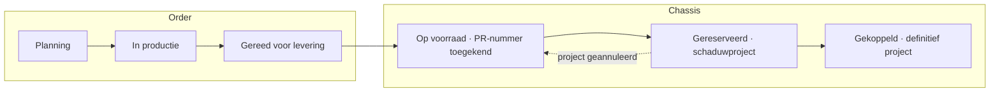
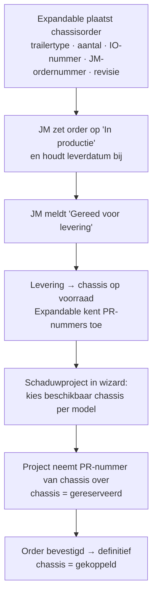

# JM Construct — chassisplanning (voorstel ter validatie)

**Status:** concept 0.1 · ter validatie · 24-07-2026
**Doel van dit document:** vastleggen wat er gebouwd gaat worden voor de gezamenlijke chassisplanning met JM Construct, zodat dit met JM en intern gevalideerd kan worden vóór de bouw start. Aannames en open vragen staan expliciet in §9.

---

## 1. Doel & context

JM Construct bouwt chassis voor Expandable. Die chassis komen **op voorraad** en krijgen van Expandable een **PR-nummer** — hetzelfde PR-nummer dat daarna in de productieplanning de enige identificatie van project én trailer is. Vandaag is er geen gedeeld beeld van: welke orders lopen er bij JM, hoe ver zijn ze, wanneer komen ze binnen en welke chassis zijn per model beschikbaar voor nieuwe (schaduw)projecten.

Er komt daarom een **aparte JM-planning** in de app, opgezet zoals het bestaande Planning-scherm: drie weergaven naast elkaar in één tabbalk — **Tijdsplanning**, **Capaciteitsplanning** en **Locatieplanning**. De planning is bedoeld om **samen met JM Construct** in te werken: JM werkt orderstatussen en leverdata bij, Expandable beheert PR-nummers en de koppeling met projecten.

## 2. Kernprincipes

1. **Het PR-nummer ontstaat bij het chassis.** Zodra een chassis op voorraad komt, kent Expandable het PR-nummer toe. Een project dat later op dat chassis wordt gepland, neemt dat PR-nummer over — er ontstaat dus nooit een tweede nummer.
2. **Voorraadgedreven plannen.** Een schaduwproject kiest uit de beschikbare chassis van het gewenste model; zonder beschikbaar chassis is direct zichtbaar dat er eerst een chassisorder nodig is.
3. **Eén gedeelde werkelijkheid met JM.** JM ziet en bewerkt de JM-planning (orders, statussen, leverdata); Expandable ziet daarnaast de koppeling met projecten. JM krijgt géén toegang tot de rest van de applicatie.

## 3. Datamodel

### 3.1 Chassisorder

Een order bij JM Construct; kan uit **meerdere chassis** bestaan.

| Veld | Type | Verplicht | Toelichting |
|---|---|---|---|
| `ordernummer` | string | ja | Volgnummer van Expandable-zijde (bijv. `CO-2026-014`). |
| `jmOrdernummer` | string | ja | Ordernummer in de administratie van JM Construct. |
| `ioNummer` | string | ja | IO-nummer (interne order / inkooporder van Expandable — exacte betekenis valideren, zie §9). |
| `revisienummer` | string | ja | Revisie per order (bijv. `R2`); wijzigt bij aangepaste specificatie. |
| `trailertype` | string | ja | Eén type per order (aanname, §9): E7P … E16HU. |
| `aantal` | number | ja | Aantal chassis in de order (≥ 1). |
| `orderstatus` | enum | ja | `planning` → `in_productie` → `gereed_voor_levering` (§3.3). |
| `verwachteOpleverdatum` | datum | ja | Verwachte leverdatum bij Expandable. |
| `geplaatsteOp` / `besteldDoor` | datum/string | ja | Traceerbaarheid. |
| `notities` | string | nee | Vrij veld (bijv. afwijkingen, transportafspraken). |

### 3.2 Chassis (individueel exemplaar)

| Veld | Type | Verplicht | Toelichting |
|---|---|---|---|
| `id` | string | ja | Interne id (niet zichtbaar). |
| `orderId` | string | ja | Herkomstorder. |
| `prNummer` | string | na levering | Door Expandable toegekend zodra het chassis op voorraad staat (PR + 4 cijfers, uniek over projecten én voorraad). |
| `status` | enum | ja | `in_productie` → `gereed_voor_levering` → `op_voorraad` → `gereserveerd` (schaduwproject) → `gekoppeld` (definitief project). |
| `projectId` | string | nee | Gekoppeld project (vanaf reservering). |
| `locatie` | string | nee | Bij JM · transport · Opslag-plaats bij Expandable (koppeling met bestaande plattegrond Opslag). |

### 3.3 Statusflow

Orderstatussen (zichtbaar voor JM én Expandable): **Planning**, **In productie**, **Gereed voor levering**. Statuswissels worden gelogd (wie, wanneer) in een orderhistorie, zoals de bestaande projecthistorie.

## 4. Schermen

Nieuw hoofdmenu-item **"JM Construct"** (onder Planning), met dezelfde tabstructuur als Planning:

### 4.1 Tijdsplanning
Tijdlijn (Gantt-achtig) van alle chassisorders: één balk per order van plaatsing tot verwachte opleverdatum, kleur per orderstatus, vandaag-lijn, en per order het aantal chassis + trailertype + revisie. Vertraging (nieuwe leverdatum later dan de vorige) wordt gemarkeerd, zoals vertraging bij externe partijen nu al werkt. Boven de tijdlijn: zoekbalk en statusfilter.

### 4.2 Capaciteitsplanning
Weekoverzicht van de productiecapaciteit bij JM (slots per week, zoals `slotsPerWeek` bij externe partijen al bestaat) tegenover het aantal chassis in productie per week. Zelfde kleurcodering als de bestaande capaciteitsschermen (ok / druk / overboekt). Daarnaast een **voorraadbalans per trailertype**: op voorraad · gereserveerd · vrij beschikbaar, plus wat er per maand binnenkomt.

### 4.3 Locatieplanning
Waar staat elk chassis: bij JM Construct (in productie / gereed voor levering), onderweg, of op een fysieke plaats in de bestaande **Opslag-plattegrond** bij Expandable. Chassis op voorraad verschijnen als kaartje met PR-nummer in de Opslag-zone (zelfde drag-and-drop als de bestaande locatieplanning). Chassis zonder PR-nummer (nog bij JM) staan in een wachtrij-paneel.

## 5. Werkstromen

1. **Order aanmaken** (Expandable, evt. samen met JM): trailertype, aantal, JM-ordernummer, IO-nummer, revisienummer, verwachte opleverdatum → status *Planning*.
2. **JM werkt bij**: status naar *In productie* / *Gereed voor levering*, leverdatum aanpassen (met reden bij vertraging), revisienummer ophogen bij specificatiewijziging.
3. **Levering & PR-toekenning**: bij binnenkomst zet Expandable de chassis *op voorraad*; per chassis wordt een PR-nummer toegekend (voorstel: automatisch het volgende vrije nummer, handmatig aanpasbaar).
4. **Schaduwproject koppelen**: de projectwizard krijgt een stap "Chassis kiezen": beschikbare chassis gefilterd op het gekozen model. Het project neemt het PR-nummer van het gekozen chassis over; het chassis wordt *gereserveerd*. Geen chassis beschikbaar → duidelijke melding + link naar de JM-planning.
5. **Annulering**: vervalt het schaduwproject, dan valt het chassis (en zijn PR-nummer) terug naar *op voorraad*.

## 6. Rollen & samenwerking

- Nieuwe persona in de rolwisselaar: **"JM Construct — partner"**. Ziet uitsluitend de JM-planning; mag orderstatus, leverdatum en revisie bijwerken en notities plaatsen. Geen toegang tot projecten, teams, beschikbaarheid of instellingen.
- Expandable-planner beheert orders, PR-toekenning en de koppeling met projecten.
- **Bekende beperking (MVP):** de app draait zonder backend op lokale browseropslag. Echte gelijktijdige samenwerking (JM en Expandable in dezelfde data) vergt een backend of synchronisatie en valt buiten deze fase; tot die tijd werkt JM in dezelfde gedeelde omgeving (zelfde Vercel-URL, eigen rol) maar met lokale data per browser. Dit is de belangrijkste architecturele keuze om te valideren (§9, V7).

## 7. Integratie met de bestaande app

- **Projectwizard**: nieuwe stap "Chassis kiezen" voor schaduwprojecten; het PR-nummer wordt niet meer los uitgegeven maar komt van het chassis (bestaande projecten behouden hun nummer; migratie maakt voor hen geen chassis aan).
- **Projectdetail → Trailer en locatie**: toont het gekoppelde chassis met herkomst (order, JM-ordernummer, revisie, leverdatum).
- **Dashboard**: widget "Chassisvoorraad per model" (vrij / gereserveerd / verwacht deze maand).
- **Externe partijen**: JM Construct blijft gewoon een externe partij; de JM-planning verwijst ernaar (contact, slots, vertraging).

## 8. Fasering

| Fase | Scope | Resultaat |
|---|---|---|
| **A — Fundament** | Datamodel + migratie, orderbeheer (tabel + ordermodal), statusflow met historie, PR-toekenning bij levering, tab Tijdsplanning | Orders zijn samen met JM bij te houden; voorraad met PR-nummers ontstaat |
| **B — Inzicht** | Tabs Capaciteits- en Locatieplanning, voorraadbalans, dashboard-widget | Volledig beeld van pijplijn, capaciteit bij JM en fysieke locatie |
| **C — Koppeling** | Wizard-stap "Chassis kiezen", reserveren/terugvallen, JM-rol met permissies | Schaduwprojecten plannen op echte voorraad; JM werkt zelfstandig mee |

## 9. Aannames & open vragen (te valideren)

| # | Vraag / aanname | Voorstel in dit plan |
|---|---|---|
| V1 | Wat is het IO-nummer precies (interne order / inkooporder) en wie geeft het uit? | Verplicht veld op de order, vrij formaat |
| V2 | Moment van PR-toekenning: bij levering (op voorraad) of al bij orderplaatsing? | Bij levering, automatisch volgend vrij nummer |
| V3 | Eén trailertype per order, of gemengde orders? | Eén type per order |
| V4 | Revisienummer: per order (geldt voor alle chassis) of per chassis? | Per order |
| V5 | Is er na "Gereed voor levering" nog een aparte eindstatus "Geleverd/afgerond" nodig op de order? | Order is afgerond zodra alle chassis op voorraad staan |
| V6 | Krijgen chassis op voorraad een plek in de bestaande Opslag-plattegrond of een aparte chassislocatie? | Bestaande Opslag-zone |
| V7 | Volstaat voorlopig de gedeelde omgeving met JM-rol (zonder realtime sync), of is een backend randvoorwaarde? | MVP zonder backend, sync later |
| V8 | Mag JM zelf orders aanmaken, of alleen bestaande orders bijwerken? | Alleen bijwerken; aanmaken door Expandable |

---

*Volgende stap: dit voorstel valideren (met name §9) — daarna wordt Fase A gebouwd.*
