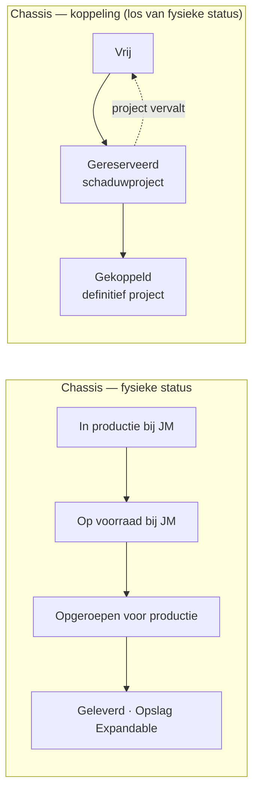
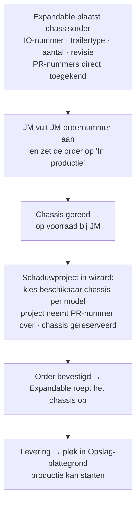

# JM Construct — chassisplanning (voorstel)

**Status:** concept 0.2 · feedback Damian 24-07-2026 verwerkt · ter afstemming met JM Construct
**Doel van dit document:** vastleggen wat er gebouwd gaat worden voor de gezamenlijke chassisplanning met JM Construct. De uitgangspunten in §9 zijn intern vastgesteld; §10 bevat wat nog met JM wordt afgestemd.

---

## 1. Doel & context

JM Construct bouwt chassis voor Expandable. Bij het **plaatsen van een chassisorder kent Expandable direct per chassis een PR-nummer toe** — hetzelfde PR-nummer dat daarna in de productieplanning de enige identificatie van project én trailer is. Gerede chassis blijven **op voorraad bij JM** totdat Expandable ze **oproept voor productie**.

Vandaag is er geen gedeeld beeld van: welke orders lopen er bij JM, hoe ver zijn ze, welke chassis staan er per model op voorraad en welke zijn al aan een (schaduw)project gekoppeld.

Er komt daarom een **aparte JM-planning** in de app, opgezet zoals het bestaande Planning-scherm: drie weergaven naast elkaar in één tabbalk — **Tijdsplanning**, **Capaciteitsplanning** en **Locatieplanning**. De planning is bedoeld om **samen met JM Construct** in te werken: JM vult het eigen ordernummer aan en werkt statussen en data bij; Expandable plaatst orders, roept chassis op en beheert de koppeling met projecten.

## 2. Kernprincipes

1. **Het PR-nummer ontstaat bij orderplaatsing.** Elk chassis in de order krijgt direct een PR-nummer (automatisch het volgende vrije nummer, handmatig aanpasbaar). Een project dat later op dat chassis wordt gepland, neemt dat PR-nummer over — er ontstaat nooit een tweede nummer.
2. **Voorraad ligt bij JM.** Gerede chassis blijven bij JM staan tot Expandable ze oproept voor productie. De planning maakt per model zichtbaar wat op voorraad staat, wat gereserveerd is en wat vrij beschikbaar is.
3. **Voorraadgedreven plannen.** Een schaduwproject kiest uit de beschikbare chassis van het gewenste model; zonder beschikbaar chassis is direct zichtbaar dat er eerst een chassisorder nodig is.
4. **Eén gedeelde werkelijkheid met JM.** JM ziet en bewerkt de JM-planning (JM-ordernummer, statussen, data); Expandable ziet daarnaast de koppeling met projecten. JM krijgt géén toegang tot de rest van de applicatie.

## 3. Datamodel

### 3.1 Chassisorder

Een order bij JM Construct; kan uit **meerdere chassis** bestaan, altijd **één trailertype per order**.

| Veld | Type | Verplicht | Toelichting |
|---|---|---|---|
| `ordernummer` | string | ja | Volgnummer van Expandable-zijde (bijv. `CO-2026-014`). |
| `ioNummer` | string | ja | **Inkoopnummer (IO)** van Expandable; vastgelegd bij plaatsing. |
| `jmOrdernummer` | string | later, door JM | Ordernummer in de administratie van JM; **JM vult dit zelf aan** na plaatsing. |
| `revisienummer` | string | ja | Revisie **per order** (bijv. `R2`); wijzigt bij aangepaste specificatie en geldt voor alle chassis in de order. |
| `trailertype` | string | ja | Eén type per order: E7P … E16HU. |
| `aantal` | number | ja | Aantal chassis in de order (≥ 1). |
| `orderstatus` | enum | ja | `planning` → `in_productie` → `gereed_voor_levering` (§3.3). |
| `verwachteOpleverdatum` | datum | ja | Verwachte datum waarop de chassis gereed zijn (op voorraad bij JM). |
| `geplaatsteOp` / `besteldDoor` | datum/string | ja | Traceerbaarheid. |
| `notities` | string | nee | Vrij veld (bijv. afwijkingen, transportafspraken). |

### 3.2 Chassis (individueel exemplaar)

| Veld | Type | Verplicht | Toelichting |
|---|---|---|---|
| `id` | string | ja | Interne id (niet zichtbaar). |
| `orderId` | string | ja | Herkomstorder. |
| `prNummer` | string | ja | **Toegekend bij orderplaatsing** (PR + 4 cijfers, uniek over projecten én voorraad); dit wordt later het projectnummer. |
| `status` | enum | ja | Fysiek: `in_productie` → `op_voorraad_jm` → `opgeroepen` → `geleverd` (§3.3). |
| `koppeling` | enum | ja | Los van de fysieke status: `vrij` → `gereserveerd` (schaduwproject) → `gekoppeld` (definitief project). |
| `projectId` | string | nee | Gekoppeld project (vanaf reservering). |
| `opgeroepenOp` / `geleverdOp` | datum | nee | Afroep- en leverdatum. |
| `locatie` | string | nee | Bij JM · onderweg · Opslag-plaats bij Expandable (na levering, via bestaande plattegrond). |

### 3.3 Statusflow

Orderstatussen (zichtbaar voor JM én Expandable): **Planning**, **In productie**, **Gereed voor levering**. De order is afgerond zodra alle chassis op voorraad bij JM staan. Statuswissels worden gelogd (wie, wanneer) in een orderhistorie, zoals de bestaande projecthistorie.

Een chassis kan dus al **gereserveerd** zijn voor een schaduwproject terwijl het nog **op voorraad bij JM** staat; het PR-nummer is er vanaf de orderplaatsing.

## 4. Schermen

Nieuw hoofdmenu-item **"JM Construct"** (onder Planning), met dezelfde tabstructuur als Planning:

### 4.1 Tijdsplanning
Tijdlijn van alle chassisorders: één balk per order van plaatsing tot verwachte opleverdatum, kleur per orderstatus, vandaag-lijn, en per order het aantal chassis, trailertype, revisie en de toegekende PR-nummers. Vertraging (nieuwe leverdatum later dan de vorige) wordt gemarkeerd, zoals bij externe partijen nu al werkt. Boven de tijdlijn: zoekbalk (o.a. op PR-, IO- en JM-nummer) en statusfilter.

### 4.2 Capaciteitsplanning
Weekoverzicht van de productiecapaciteit bij JM (slots per week, zoals `slotsPerWeek` bij externe partijen al bestaat) tegenover het aantal chassis in productie per week — zelfde kleurcodering als de bestaande capaciteitsschermen (ok / druk / overboekt). Daarnaast een **voorraadbalans per trailertype**: op voorraad bij JM · gereserveerd · vrij beschikbaar · in productie, plus wat er per maand gereed komt.

### 4.3 Locatieplanning
Waar staat elk chassis: **bij JM Construct** (in productie / op voorraad), **onderweg** (opgeroepen), of — na levering — op een fysieke plaats in de bestaande **Opslag-plattegrond** bij Expandable. Geleverde chassis verschijnen als kaartje met PR-nummer in de Opslag-zone (zelfde drag-and-drop als de bestaande locatieplanning); chassis bij JM staan in een eigen paneel "Bij JM Construct".

## 5. Werkstromen

1. **Order plaatsen** (Expandable): IO-nummer, trailertype, aantal, revisienummer, verwachte opleverdatum → status *Planning*; per chassis wordt direct een PR-nummer toegekend (volgend vrij nummer, aanpasbaar).
2. **JM vult aan en werkt bij**: JM-ordernummer toevoegen, status naar *In productie* / *Gereed voor levering*, leverdatum aanpassen (met reden bij vertraging). Revisienummer ophogen bij specificatiewijziging (geldt voor de hele order).
3. **Gereed → op voorraad bij JM**: gerede chassis blijven bij JM staan en tellen mee als beschikbare voorraad per model.
4. **Schaduwproject koppelen**: de projectwizard krijgt een stap "Chassis kiezen" — beschikbare chassis (op voorraad of gepland, koppeling *vrij*) gefilterd op het gekozen model. Het project neemt het PR-nummer van het gekozen chassis over; het chassis wordt *gereserveerd*. Geen chassis beschikbaar → duidelijke melding + link naar de JM-planning.
5. **Oproepen voor productie**: bij (of vóór) de orderbevestiging roept Expandable het chassis op — status *Opgeroepen*, daarna *Geleverd* met een plek in de Opslag-plattegrond, op tijd vóór de start van de productie.
6. **Annulering**: vervalt het schaduwproject, dan valt de koppeling terug naar *vrij*; het chassis (met PR-nummer) blijft gewoon op voorraad.

## 6. Rollen & samenwerking

- Nieuwe persona in de rolwisselaar: **"JM Construct — partner"**. Ziet uitsluitend de JM-planning; mag het JM-ordernummer aanvullen, orderstatus en leverdatum bijwerken, revisie ophogen en notities plaatsen. Geen toegang tot projecten, teams, beschikbaarheid of instellingen.
- Expandable plaatst orders, kent PR-nummers toe (automatisch bij plaatsing), reserveert chassis voor projecten en doet de afroep.
- **Bekende beperking (MVP, vastgesteld):** de app draait zonder backend op lokale browseropslag. Echte gelijktijdige samenwerking vergt later een backend of synchronisatie; tot die tijd werkt JM in dezelfde gedeelde omgeving (zelfde Vercel-adres, eigen rol) met lokale data per browser.

## 7. Integratie met de bestaande app

- **Projectwizard**: nieuwe stap "Chassis kiezen" voor schaduwprojecten; het PR-nummer wordt niet meer los uitgegeven maar komt van het chassis (bestaande projecten behouden hun nummer; de migratie maakt voor hen geen chassis aan).
- **Projectdetail → Trailer en locatie**: toont het gekoppelde chassis met herkomst (ordernummer, IO-nummer, JM-ordernummer, revisie, fysieke status en leverdatum).
- **Dashboard**: widget "Chassisvoorraad per model" (vrij / gereserveerd / in productie / verwacht deze maand).
- **Externe partijen**: JM Construct blijft gewoon een externe partij; de JM-planning verwijst ernaar (contact, slots, vertraging).

## 8. Fasering

| Fase | Scope | Resultaat |
|---|---|---|
| **A — Fundament** | Datamodel + migratie, orderbeheer (tabel + ordermodal), PR-toekenning bij plaatsing, statusflow met historie, tab Tijdsplanning | Orders zijn samen met JM bij te houden; voorraad met PR-nummers ontstaat |
| **B — Inzicht** | Tabs Capaciteits- en Locatieplanning, voorraadbalans, afroep-flow, dashboard-widget | Volledig beeld van pijplijn, voorraad bij JM en fysieke locatie |
| **C — Koppeling** | Wizard-stap "Chassis kiezen", reserveren/terugvallen, JM-rol met permissies | Schaduwprojecten plannen op echte voorraad; JM werkt zelfstandig mee |

## 9. Vastgestelde uitgangspunten (intern gevalideerd 24-07-2026)

| # | Uitgangspunt | Besluit |
|---|---|---|
| U1 | IO-nummer | Het **inkoopnummer** van Expandable; verplicht bij orderplaatsing |
| U2 | Moment van PR-toekenning | **Direct bij orderplaatsing**, per chassis (volgend vrij nummer, aanpasbaar) |
| U3 | JM-ordernummer | Wordt **later door JM zelf** aangevuld |
| U4 | Trailertypes per order | **Eén type per order** |
| U5 | Revisienummer | **Per order**; geldt voor alle chassis in de order |
| U6 | Voorraadlocatie | Gerede chassis blijven **op voorraad bij JM** tot Expandable ze **oproept voor productie**; na levering plek in de bestaande Opslag-plattegrond |
| U7 | Ordereinde | Order is afgerond zodra alle chassis op voorraad bij JM staan |
| U8 | Architectuur MVP | Gedeelde omgeving met JM-rol, zonder realtime sync; backend/synchronisatie later |
| U9 | Orders aanmaken | Door Expandable; JM werkt bestaande orders bij |

## 10. Nog af te stemmen met JM Construct

1. **Afroeptermijn**: hoeveel werkdagen zitten er tussen oproepen en levering (voor de automatische planning van de afroepdatum)?
2. **Capaciteit**: hoeveel chassis kan JM parallel in productie hebben (slots per week) — input voor de Capaciteitsplanning-tab?
3. **Werkwijze bijwerken**: werkt JM de status per order bij of ook per individueel chassis?

---

*Volgende stap: dit voorstel doornemen met JM Construct (§10) — daarna wordt Fase A gebouwd.*
